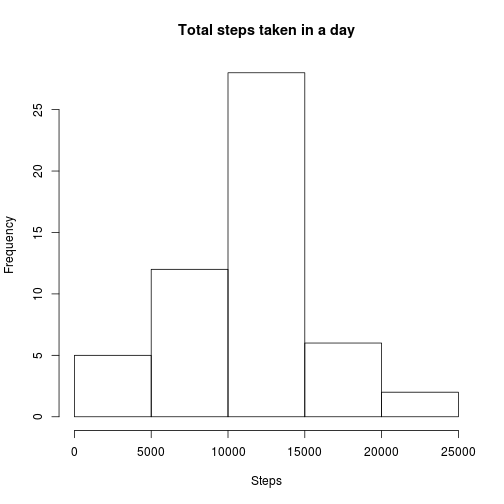
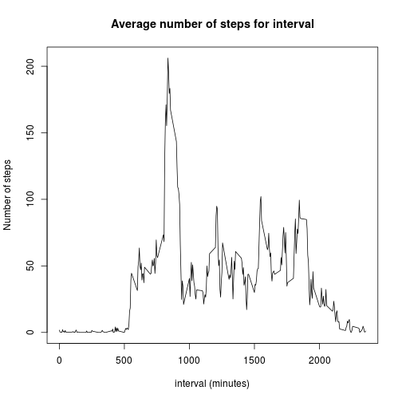
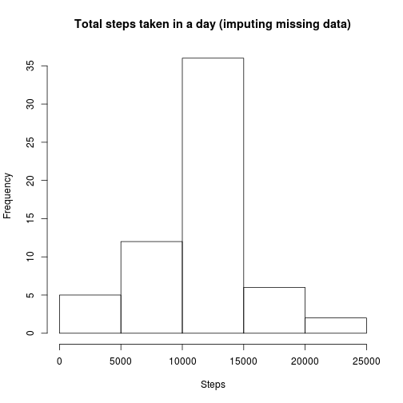
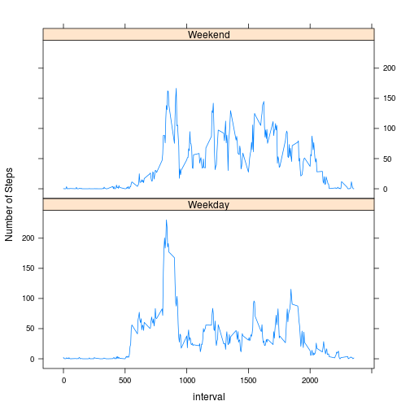

Download the data if it doesn't exist already

```r
zipFilename <- "activity.zip"
if(!file.exists(zipFilename)) {
    download.file("https://d396qusza40orc.cloudfront.net/repdata%2Fdata%2Factivity.zip", zipFilename, method="curl")
}

uncompressedFilename <- "activity.csv"
if(!file.exists(uncompressedFilename)){
    unzip(zipFilename)
}

rawData <- read.csv(uncompressedFilename, stringsAsFactors=FALSE)
```


transform $date to the proper data format:

```r
rawData <- read.csv("activity.csv", stringsAsFactors=FALSE)
rawData$date <- as.Date(rawData$date)
```

compute the total # of steps per day:

```r
totalStepsPerDay <- aggregate(steps ~ date, data = rawData, FUN="sum")
head(totalStepsPerDay)
```

```
##         date steps
## 1 2012-10-02   126
## 2 2012-10-03 11352
## 3 2012-10-04 12116
## 4 2012-10-05 13294
## 5 2012-10-06 15420
## 6 2012-10-07 11015
```

make a histogram of the total number of steps taken each day:

```r
hist(totalStepsPerDay$steps, main="Total steps taken in a day", xlab="Steps")
```

 

calculate mean/median of the number of steps per day

```r
steps_mean <- format(mean(totalStepsPerDay$steps), digits=7)
steps_mean_formatted <- format(steps_mean, digits=7)
steps_median <- median(totalStepsPerDay$steps)
```

the mean number of steps per day is 10766.19  
the median number of steps per day is 10765


compute the average # of steps per interval, averaged across all days:

```r
averageStepsPerInterval <- aggregate(steps ~ interval, data = rawData, FUN="mean")
head(averageStepsPerInterval)
```

```
##   interval     steps
## 1        0 1.7169811
## 2        5 0.3396226
## 3       10 0.1320755
## 4       15 0.1509434
## 5       20 0.0754717
## 6       25 2.0943396
```

plot:


```r
plot(averageStepsPerInterval$interval, averageStepsPerInterval$steps, type="l", main="Average number of steps for interval", xlab="interval (minutes)", ylab="Number of steps")
```

 


```r
max_steps <- max(averageStepsPerInterval$steps)
max_interval <- averageStepsPerInterval[averageStepsPerInterval[,2] == max_steps,]
max_interval_num <- max_interval[1]
max_interval_mean_steps <- max_interval[2]
```


The inteval with the maximum number of steps on average is interval 835, with an average of 206.1698113 steps


Calculate the number of rows with missing data:

```r
num_data_with_na <- length(which(is.na(rawData$steps)))
num_data_with_na
```

```
## [1] 2304
```


Create a new dataset with the missing data imputed as the average # of steps for that 
interval, averaged across all days

```r
dataWithIntervalMeans <- merge(rawData, averageStepsPerInterval, by="interval")
dataWithIntervalMeans$stepsImputed <- ifelse(
    is.na(dataWithIntervalMeans$steps.x), 
    dataWithIntervalMeans$steps.y, 
    dataWithIntervalMeans$steps.x)
```


```r
totalStepsPerDay <- aggregate(dataWithIntervalMeans$stepsImputed ~ date, data = dataWithIntervalMeans, FUN="sum")
names(totalStepsPerDay)[2] <- "totalSteps"
hist(totalStepsPerDay$totalSteps, main="Total steps taken in a day (imputing missing data)", xlab="Steps")
```

 


```r
imputed_mean <- format(mean(totalStepsPerDay[,2]), digits=10)
imputed_median <- format(median(totalStepsPerDay[,2]), digits=10)
```

the mean number of steps per day is 10766.18868  
the median number of steps per day is 10766.18868
Interestingly, they are the same.

Create a new factor varible that indicates if the date is a weekend

```r
weekend_days <- c("Saturday", "Sunday")
dataWithIntervalMeans$isWeekend <- factor(
    weekdays(dataWithIntervalMeans$date) %in% weekend_days, 
    labels=c("Weekday", "Weekend"))
sums <- aggregate(
    dataWithIntervalMeans$stepsImputed, 
    list(
        isWeekend = dataWithIntervalMeans$isWeekend, 
        interval=dataWithIntervalMeans$interval), 
    mean)
```


Now let's analyse the data with that separation

```r
library(lattice)
xyplot(
  x ~ interval | isWeekend, 
  data=sums, 
  type="l",
  ylab="Number of Steps",
  layout=c(1,2))
```

 
